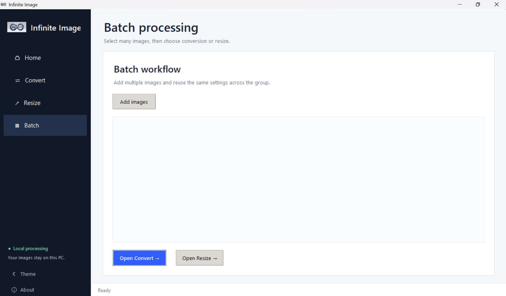
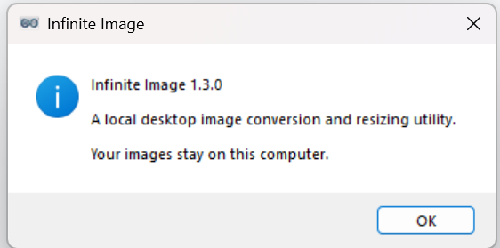

# InfiniteImage

<p align="center">
  
</p>

<p align="center">
  <b>A simple, private Windows image converter and resizer.</b>
</p>

<p align="center">
  Convert • Resize • Preview • Batch Process
</p>

---

## ✨ Features

### 🖼 Image Conversion
Convert images between commonly used formats:

- JPG
- PNG
- WEBP
- BMP
- TIFF
- GIF
- ICO

### 📐 Image Resizing

- Custom width and height
- Maintain aspect ratio
- Preset dimensions
- Resize by percentage
- File-size based resizing

### 👀 Image Preview

- Preview selected images
- Supports transparency
- Handles image orientation
- View image dimensions and file information

### 📦 Batch Processing

Process multiple images in one operation instead of converting each file individually.

### 💾 Custom Output Names

Choose the output filename and save location instead of being forced to use the original filename.

### 🔒 Local Processing

Your images are processed locally on your computer.

No image uploads to a remote server are required.

---

## 🖥️ Download

The easiest way to use InfiniteImage is to download the latest Windows installer from the **Releases** section.

### Windows

1. Download `InfiniteImage_Setup_v1.3.0.exe`
2. Run the installer
3. Follow the installation instructions
4. Launch **Infinite Image**
5. Start converting or resizing your images

> No Python installation is required when using the Windows installer.

---

## 📸 Screenshots





---

## 🛠️ For Developers

### Requirements

- Python 3.x
- Pillow
- PyInstaller

### Install

Clone the repository and open the project folder.

Install the required packages:

```bash
pip install -r requirements.txt

### Run from source
python main.py

### Build the Application
The project includes a Windows build script.

###Run:

build.bat

### The script:

### Creates the Python virtual environment if required
###Installs the required packages
### Removes previous build files
###Runs PyInstaller
### Creates InfiniteImage.exe

### The executable will be generated in:

dist/InfiniteImage.exe
📦 Build the Windows Installer

### The project uses Inno Setup for creating the Windows installer.

### The installer configuration is provided in:

installer.iss

## The generated installer is placed in:

installer_output/

Project

### InfiniteImage is a Windows desktop application designed to provide convenient image conversion and resizing tools through a simple graphical interface.