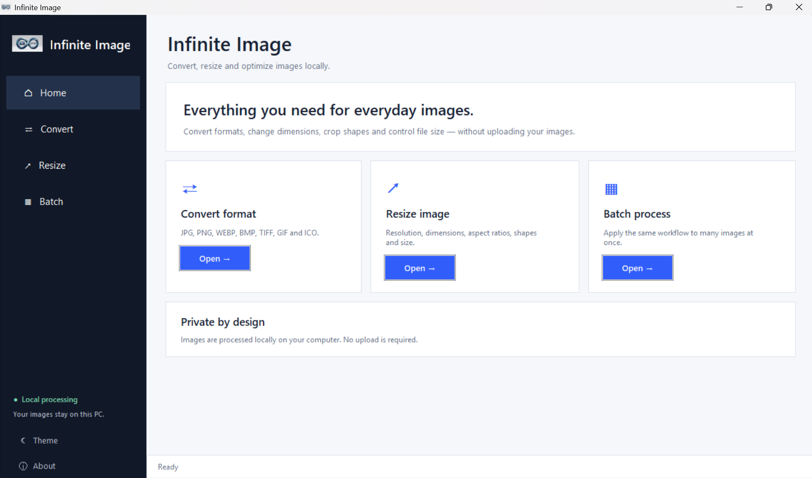
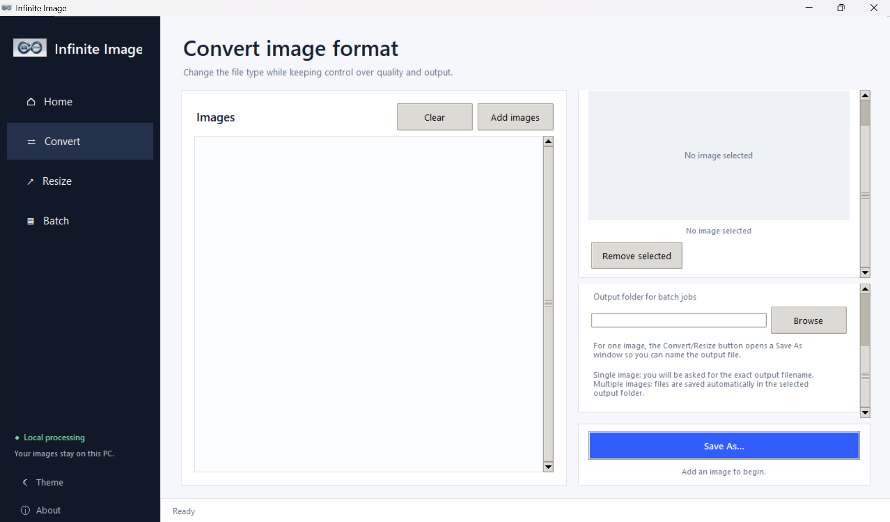
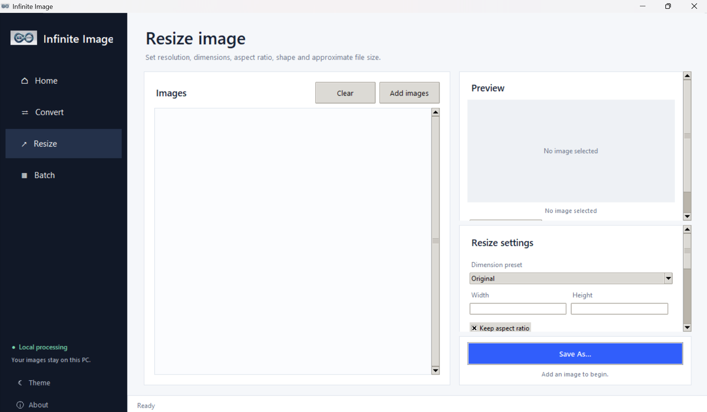

# InfiniteImage

<p align="center">
  
</p>

<p align="center">
  <b>A simple, private Windows image converter and resizer.</b>
</p>

<p align="center">
  Convert • Resize • Preview • Batch Process
</p>

<p align="center">
  <a href="../../releases/latest">
    <strong>⬇️ Download for Windows</strong>
  </a>
</p>
---

## 📌 About

InfiniteImage is a Windows desktop application for converting and resizing images through a simple graphical interface.

It is designed to make common image-processing tasks easy without requiring users to use command-line tools or online image-processing websites.


### Why InfiniteImage?

- 🔒 **Private** — images are processed locally
- ⚡ **Simple** — no complicated setup for Windows users
- 📦 **Batch processing** — work with multiple images
- 💾 **Flexible output** — choose output names and locations
- 🖥️ **Desktop application** — no browser required

## ✨ Features

### 🖼 Image Conversion
Convert images between commonly used formats:

- JPG
- PNG
- WEBP
- BMP
- TIFF
- GIF
- ICO

### 📐 Image Resizing

- Custom width and height
- Maintain aspect ratio
- Preset dimensions
- Resize by percentage
- File-size based resizing

### 👀 Image Preview

- Preview selected images
- Supports transparency
- Handles image orientation
- View image dimensions and file information

### 📦 Batch Processing

Process multiple images in one operation instead of converting each file individually.

### 💾 Custom Output Names

Choose the output filename and save location instead of being forced to use the original filename.

### 🔒 Local Processing

Your images are processed locally on your computer.

No image uploads to a remote server are required.

---

## 🖥️ Download & Install

### For Windows Users

You do **not** need Python, Git, VS Code, or any programming tools to use InfiniteImage.

#### 1. Download

Go to the latest release:

**[⬇️ Download InfiniteImage for Windows](../../releases/latest)**

Under **Assets**, download:

```text
InfiniteImage_Setup_v1.3.0.exe 
```


### 2. Install

Once the download is complete:

Open InfiniteImage_Setup_v1.3.0.exe
Follow the installation wizard
Choose the installation location if required
Complete the installation

### 3. Launch

After installation, launch Infinite Image from the Start Menu or desktop shortcut.

### 4. Start using InfiniteImage

You can now:

Convert images between formats
Resize images
Preview images
Process multiple images
Choose custom output filenames
Control output file size

Your images are processed locally on your computer.


## 👨‍💻 For Developers

If you want to run or modify InfiniteImage from source, you will need:

- Python 3.x
- Git
- A code editor such as VS Code

### 1. Clone the repository

```bash
git clone https://github.com/YOUR-USERNAME/InfiniteImage.git
cd InfiniteImage

Replace YOUR-USERNAME with your GitHub username.
```

### 2. Install dependencies

pip install -r requirements.txt

### 3. Run InfiniteImage
python main.py

### 4. Build the executable

On Windows:

build.bat

The executable will be created in:

dist/InfiniteImage.exe


---


## 📸 Screenshots

### Main Interface



### Image Conversion



### Image Resizing


---

## 📄 License

InfiniteImage is licensed under the MIT License.
See the [LICENSE](LICENSE) file for details.


